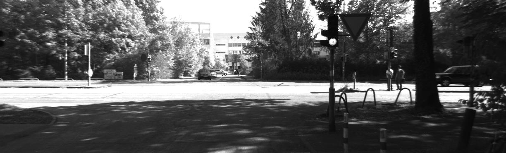
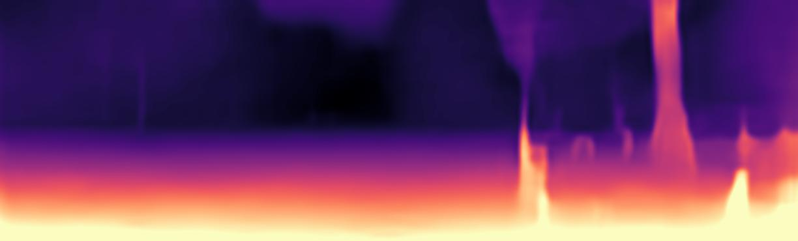
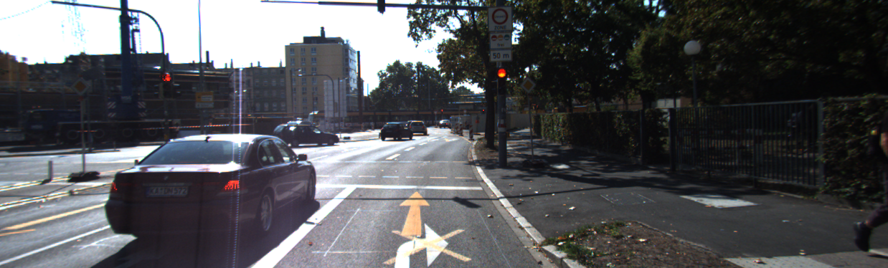
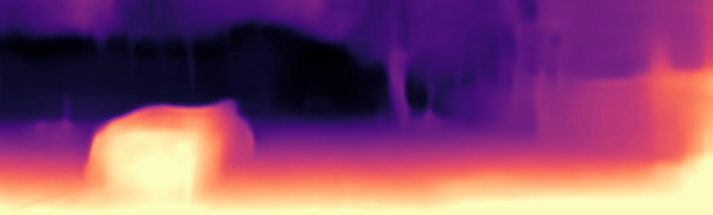
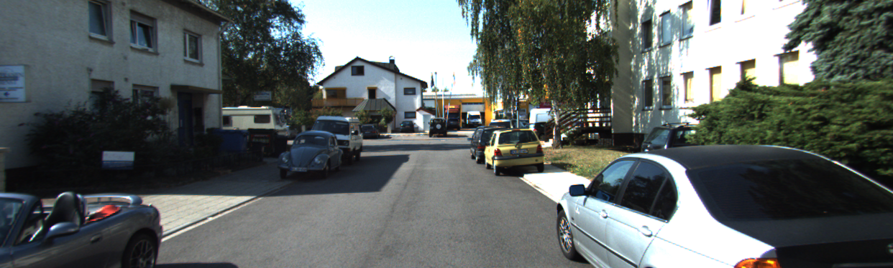

# Self-Supervised Monocular Depth Estimation using Lite-Mono

A research implementation for self-supervised monocular depth estimation using the KITTI dataset.

> This project is a replication of the Lite-Mono paper.  
> **Paper:** N. Zhang, F. Nex, G. Vosselman, and N. Kerle, "Lite-Mono: A Lightweight CNN and Transformer Architecture for Self-Supervised Monocular Depth Estimation," Proceedings of the IEEE/CVF Conference on Computer Vision and Pattern Recognition (CVPR), 2023, pp. 18537–18546.  
> **Paper:** https://openaccess.thecvf.com/content/CVPR2023/html/Zhang_Lite-Mono_A_Lightweight_CNN_and_Transformer_Architecture_for_Self-Supervised_Monocular_CVPR_2023_paper.html

## Overview

Monocular depth estimation predicts dense scene depth from a single RGB image. This project implements a self-supervised training and evaluation pipeline for lightweight monocular depth estimation using the KITTI dataset.

The training setup uses image sequences to learn depth without requiring dense ground-truth depth maps during training.

## Objectives

- Study self-supervised monocular depth estimation.
- Understand the Lite-Mono architecture and its components.
- Prepare the KITTI dataset and training splits.
- Train the model using a self-supervised monocular depth-estimation pipeline.
- Evaluate model checkpoints on the KITTI Eigen split.
- Generate qualitative depth maps from RGB images.
- Adapt the implementation for the modern PyTorch software ecosystem.

## Model Architecture

The model follows a lightweight hybrid CNN–Transformer design.

### Main Components

- **Convolutional feature extraction** for efficient low-level feature learning.
- **CDC (Consecutive Dilated Convolutions)** for multi-scale local feature learning.
- **LGFI (Local-Global Feature Interaction)** for lightweight global context modeling.
- **Hierarchical encoder** for multi-scale feature extraction.
- **Depth decoder** for producing dense depth predictions.

Overall pipeline:

```text
Input RGB Image
       ↓
Lite-Mono Encoder
       ↓
CDC + LGFI Blocks
       ↓
Multi-scale Features
       ↓
Depth Decoder
       ↓
Predicted Depth
```

## Dataset

The project uses the **KITTI dataset** with the Eigen-Zhou training and validation split.

Dataset split used:

| Split | Images |
|---|---:|
| Training | 39,810 |
| Validation | 4,424 |

Evaluation is performed using the KITTI Eigen split.

## Training

Training was performed using checkpoint-based multi-session runs because of limited GPU session durations.

The training workflow included:

1. KITTI dataset preparation.
2. Generation of training and validation file lists.
3. Environment and dependency setup.
4. Pretrained encoder initialization.
5. Self-supervised model training.
6. Periodic checkpoint generation.
7. KITTI Eigen-split evaluation.
8. Qualitative depth-map generation.

The implementation was also updated to work with newer versions of PyTorch, torchvision, Pillow, and NumPy.

## Experimental Results

The following results were obtained during the training runs:

| Epoch | Abs Rel | RMSE | δ1 |
|---:|---:|---:|---:|
| 5 | 0.173 | 5.792 | 0.775 |
| 10 | 0.147 | 5.266 | 0.812 |
| 17 | **0.143** | **5.231** | **0.823** |
| 20 | 0.147 | 5.242 | 0.816 |

The best observed checkpoint was **Epoch 17**, with:

- **Abs Rel:** 0.143
- **RMSE:** 5.231
- **δ1:** 0.823

## Qualitative Results

The repository contains sample RGB inputs and their corresponding predicted depth maps.

### Example 1

**Input image**



**Predicted depth**



### Example 2

**Input image**



**Predicted depth**



### Example 3

**Input image**



**Predicted depth**


## Research Challenges and Solutions

### Limited GPU Session Duration

Training was divided into multiple checkpoint-based sessions so that progress could be saved and resumed.

### Software Compatibility

Several parts of the implementation were updated to maintain compatibility with the modern PyTorch ecosystem, including:

- Updated learning-rate scheduler implementation.
- Updated torchvision pretrained-weight loading.
- Updated Pillow image-resampling API.
- Updated NumPy integer type usage.
- Updated Python iterator usage.

### Evaluation and Convergence Verification

Model checkpoints were periodically evaluated on the KITTI Eigen split to monitor training progress and compare quantitative metrics across epochs.

## Repository Structure

```text
Lite-Mono/
│
├── datasets/
│   └── ...
│
├── networks/
│   ├── resnet_encoder.py
│   └── ...
│
├── splits/
│   └── eigen_zhou/
│       ├── train_files.txt
│       └── val_files.txt
│
├── outputs/
│   ├── input1.png
│   ├── depthmap1.jpeg
│   ├── input2.png
│   ├── depthmap2.jpeg
│   ├── input3.png
│   └── depthmap3.jpeg
│
├── evaluate_depth.py
├── kitti_utils.py
├── layers.py
├── options.py
├── test_simple.py
├── train.py
├── trainer.py
├── utils.py
└── README.md
```

## Evaluation

To evaluate a trained checkpoint:

```bash
python evaluate_depth.py \
    --load_weights_folder path/to/weights \
    --data_path path/to/kitti_data \
    --eval_split eigen \
    --num_workers 4
```

The evaluation reports the following metrics:

- **Abs Rel**
- **Sq Rel**
- **RMSE**
- **RMSE log**
- **δ1**
- **δ2**
- **δ3**

## Single-Image Inference

To generate a depth prediction for a single image:

```bash
python test_simple.py \
    --image_path path/to/image \
    --load_weights_folder path/to/weights
```

## Dependencies

Additional packages used during the setup include:

```bash
pip install tensorboardX
pip install thop
```

Install the remaining dependencies according to the project's environment configuration.

## Citation

If you use this implementation or build upon this work, please cite the Lite-Mono paper:

```bibtex
@inproceedings{zhang2023lite,
    title={Lite-Mono: A Lightweight CNN and Transformer Architecture
           for Self-Supervised Monocular Depth Estimation},
    author={Zhang, Ning and Nex, Francesco and Vosselman, George and Kerle, Norman},
    booktitle={Proceedings of the IEEE/CVF Conference on Computer Vision
               and Pattern Recognition},
    pages={18537--18546},
    year={2023}
}
```
